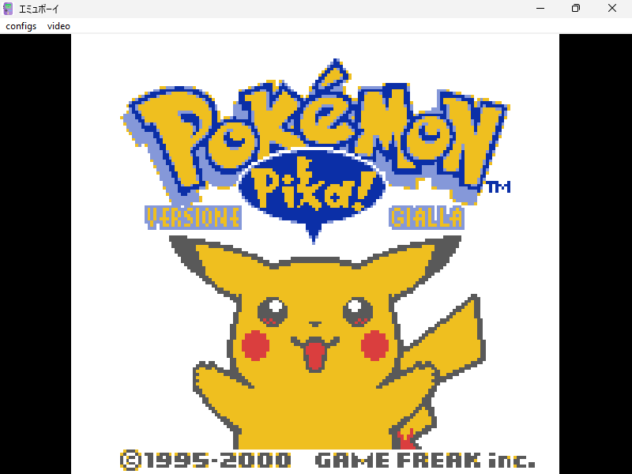

# EmuBoy (エミュボイ)

## General Information

EmuBoy is a simple GameBoy/GameBoy Color/MegaDuck emulator 
that supports a variety of different MBCs.

## How to use

From command line executes:
`` 
emuboy.exe <rom path>
``
Optionally, you can just drag and drop the rom file to ```emuboy.exe``` file.

## Commands

| PC | GameBoy |
|----------|----------|
| Z   | B     |
| X    | A     |
| ARROW KEYS   | DPAD     |
| RIGHT SHIFT   | SELECT     |
| ENTER   | START     |

Controller's inputs are also properly mapped to the emulated device

### Mapper Supported

- [x] MBC1
- [x] MBC1M
- [x] MBC2
- [x] MBC3
- [x] MBC5
- [x] MBC7 (tilt sensor is emulated via mouse dragging or controller's gyroscope)
- [x] MMM01
- [x] M161
- [x] GAMEBOY CAMERA
- [x] MEGADUCK MAPPER 1
- [x] MEGADUCK MAPPER 2

## Hardware Features

- [x] Proper interrupt and cpu timings (for games like Pinball Deluxe)
- [x] Basic PPU rendering
- [ ] Pixel's FIFO (the emulator uses a scanline renderer)
- [x] Correct timer's timing
- [ ] Audio Quirks
- [x] RTC emulation
- [x] Rumble emulation, if a controller with rumble is connected and the emulated cartridge supports it.


## Additional Features

- [X] Classic .sav file
- [x] Turbo mode (via TAB button)
- [x] HLE GBC colorization of DMG games (you don't need to have gbc bios)
- [x] Debug View (allow user to visualize BG-RAM and OAM)
- [x] GameShark (put your gameshark codes in data/gameshark.txt)
- [x] Custom Bios (put your dmg bios in ```data/dmg_boot.bin``` and your cgb bios in ```data/cgb_boot.bin```)
- [ ] Savestates and Loadstates
- [X] Force DMG mode also for CGB games (select it in the ```data/confi.ini``` file)
- [X] Link Cable Emulation via Ethernet (select the IP and ports in ```data/config.ini```). This is an experimental feature and make the emulation very slow. The game will start only when both peers are successfully connected to each other.
- [X] Upscaling filters:
    - Scale2x
    - Scale3x
    - Hq2x
    - Hq3x

## Demo

A demo is available [here](https://yughias.github.io/pages/emuboy/emulator.html)

## Screenshots




